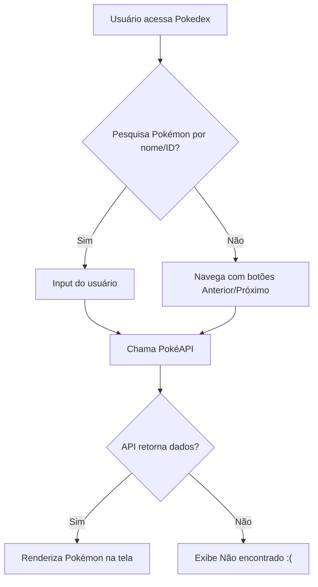
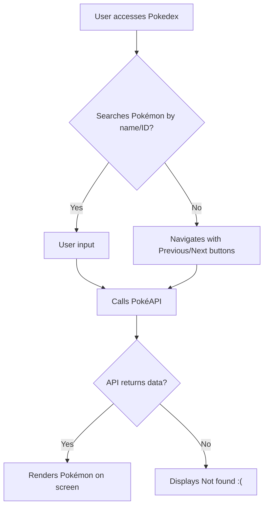

# Pokédex DIO 🧢


Projeto desenvolvido durante a formação da Digital Innovation One, com o objetivo de colocar em prática os fundamentos de HTML, CSS e JavaScript de forma divertida, explorando a API REST do universo Pokémon. 🧬

## 📌 Sobre o Projeto

Essa Pokédex consome dados da [PokéAPI](https://pokeapi.co/) e permite ao usuário:

- Pesquisar um Pokémon pelo nome ou número;
- Navegar entre os Pokémon com os botões "Anterior" e "Próximo";
- Visualizar imagem, nome e ID do Pokémon;
- Aproveitar uma experiência visual estilizada com uma pegada retrô.

## 📌 About the Project

This project was developed during the Digital Innovation One (DIO) bootcamp, aiming to apply HTML, CSS, and JavaScript fundamentals in a fun way, exploring the Pokémon universe's REST API. 🧬

This Pokédex consumes data from the [PokéAPI](https://pokeapi.co/) and allows the user to:

- Search for a Pokémon by name or number;
- Navigate between Pokémon using "Previous" and "Next" buttons;
- View Pokémon image, name, and ID;
- Enjoy a stylized visual experience with a retro feel.

## 💡 Melhorias implementadas

Apesar da inspiração vir diretamente do repositório oficial da DIO ([js-developer-pokedex](https://github.com/digitalinnovationone/js-developer-pokedex)), realizei algumas melhorias:

- Layout responsivo com bordas arredondadas e sombras suaves;
- Fonte estilo retrô "Press Start 2P" para dar aquele charme nostálgico;
- Rodapé com créditos do projeto;
- Melhor tratamento de erros ao buscar um Pokémon inexistente.

## 💡 Implemented Improvements

Although inspired directly by the official DIO repository ([js-developer-pokedex](https://github.com/digitalinnovationone/js-developer-pokedex)), I implemented several improvements:

- Responsive layout with rounded borders and soft shadows;
- Retro-style "Press Start 2P" font for a nostalgic charm;
- Footer with project credits;
- Better error handling when searching for a non-existent Pokémon.

## 🛠️ Tecnologias utilizadas

- HTML5
- CSS3
- JavaScript ES6
- [PokéAPI](https://pokeapi.co/)

## 🛠️ Technologies Used

- HTML5
- CSS3
- JavaScript ES6
- [PokéAPI](https://pokeapi.co/)

## 🚀 Como rodar o projeto

1. Clone o repositório:
```bash
git clone https://github.com/galafis/Construindo-uma-Pokedex-com-JavaScript
```
2. Acesse a pasta do projeto e abra o `docs/index.html` em seu navegador (ou visite a página do GitHub Pages):
```bash
cd Construindo-uma-Pokedex-com-JavaScript
```

## 🚀 How to Run the Project

1. Clone the repository:
```bash
git clone https://github.com/galafis/Construindo-uma-Pokedex-com-JavaScript
```
2. Access the project folder and open `docs/index.html` in your browser (or visit the GitHub Pages link):
```bash
cd Construindo-uma-Pokedex-com-JavaScript
```

## 👨‍💻 Autor
Gabriel Lafis — estudante de Ciência de Dados e entusiasta da web.

## 👨‍💻 Author
Gabriel Lafis — Data Science student and web enthusiast.

---

Esse projeto foi uma forma divertida de reforçar conhecimentos em JavaScript e consumo de APIs. Se quiser sugerir melhorias, fique à vontade para abrir um Pull Request ou mandar uma ideia! 😉

---

This project was a fun way to reinforce knowledge in JavaScript and API consumption. If you want to suggest improvements, feel free to open a Pull Request or send an idea! 😉

## 📊 Fluxo do Projeto




## 📊 Project Flow




## 📋 Descrição

Descreva aqui o conteúdo desta seção.

## 📋 Description

Describe the content of this section here.

## 📦 Instalação

Descreva aqui o conteúdo desta seção.

## 📦 Installation

Describe the content of this section here.

## 💻 Uso

Descreva aqui o conteúdo desta seção.

## 💻 Usage

Describe the content of this section here.

## 📄 Licença

Descreva aqui o conteúdo desta seção.

## 📄 License

Describe the content of this section here.

